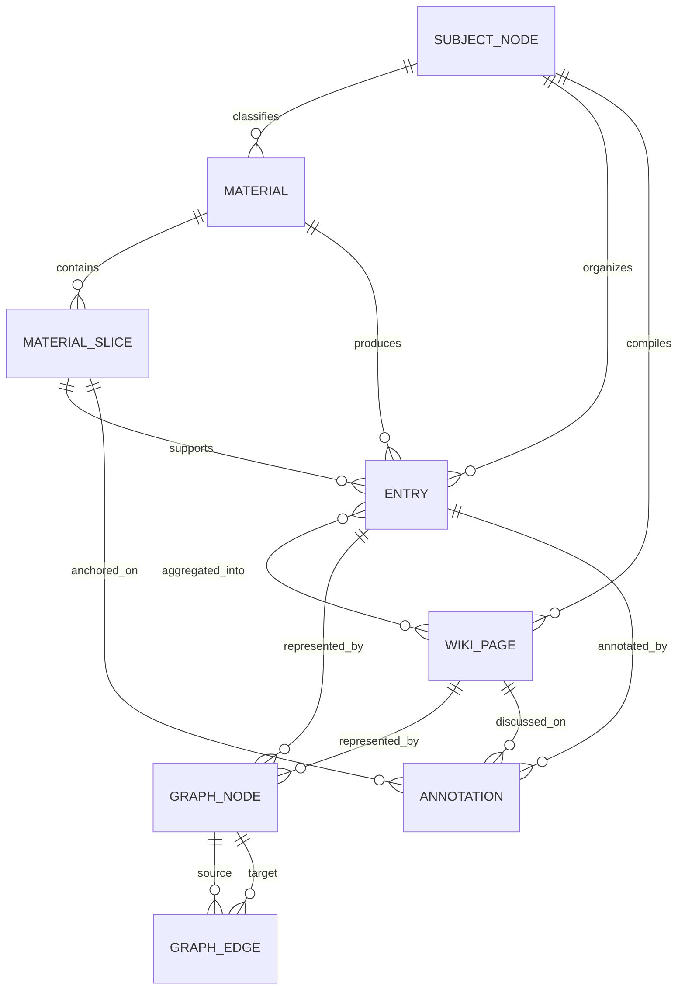

# KIVO 信息结构化处理与呈现方式

OpenClaw(ux-01 子Agent)｜2026-05-25

## 1. 结论

KIVO 的信息架构应收敛成一条主线：Material → Slice → Entry → Wiki Page → Graph。

- Material 是原始文件。
- Slice 是材料中的可定位片段。
- Entry 是最小知识单元。
- Wiki Page 是面向用户阅读的聚合页。
- Graph 是 Entry/Wiki 之间的关系层。

当前最大问题不是缺表。问题在于多套结构没有统一：`materials`、`subject_nodes`、`entries(type=wiki_page)`、`wiki_links`、`graph_edges` 都存在，但 UI 以「空间/目录」为中心，用户看不到材料如何变成领域知识。

证据：代码中存在 `/wiki/materials`、`/wiki`、`/graph`、`/search` 页面；DB 有 `materials`、`entries`、`subject_nodes`、`graph_nodes`、`graph_edges`、`wiki_links`。当前 `wiki_links=0`、`graph_edges=6256`，说明关系存储分裂。

## 2. 实体关系图

## 3. 实体定义和关系

### 3.1 Material

Material 是用户上传的原始材料。一个材料可以是 PDF、图片、笔记、音频、视频。

关系：

- 一个 Material 有多个 Slice。
- 一个 Material 产出多个 Entry。
- 一个 Material 可归入一个或多个 Subject Node。
- 一个 Material 可贡献给多个 Wiki Page。

现状证据：`materials` 表有 `file_name`、`status`、`space_id`、`wiki_page_count`、`wiki_page_ids_json`、`subject_node_id`、`slice_count`、`extract_count`、`asset_kind` 等字段；当前材料状态包含 done、failed、pending、processing。

### 3.2 Material Slice

Material Slice 是原材料里的可定位片段。PDF 是页码/段落，图片是坐标区域，音视频是时间戳。

关系：

- 一个 Slice 属于一个 Material。
- 一个 Slice 可以支持多个 Entry。
- 一个 Entry 可以来自多个 Slice。

现状证据：当前没有独立 `material_slices` 表；来源定位散落在 `entries.metadata_json.sourceRange` 和 `entries.source_json.materialId`。这能工作，但不利于做材料阅读器、原文高亮和批注锚点。

### 3.3 Entry

Entry 是最小知识单元。它可以是概念、方法、题目、易错点、批注。

关系：

- 一个 Entry 可以来自多个材料片段。
- 一个 Entry 可属于一个或多个主题节点。
- 一个 Entry 可以被一个或多个 Wiki Page 聚合。
- 一个 Entry 对应一个 Graph Node。

现状证据：`entries` 表包含 `type`、`title`、`content`、`summary`、`source_json`、`metadata_json`、`parent_id`、`subject_id`、`entry_type`；当前 `entry_type` 统计中 concept 783、question 338、method 104、mistake 10、annotation 2、空类型 311。

### 3.4 Wiki Page

Wiki Page 是用户阅读领域知识的聚合页面，不是原始知识存储。

关系：

- 一个 Wiki Page 聚合多个 Entry。
- 一个 Wiki Page 属于一个 Subject Node。
- 一个 Wiki Page 展示多个来源材料。
- 一个 Wiki Page 可在图谱中作为一个节点，也可展示底层 Entry 的关系。

现状证据：spec FR-P06 写明「页面是编译产物，不是手写产物」；当前 `entries.type='wiki_page'` 存储 Wiki 页面，`source_json`/`metadata_json` 里已有 `subject_node_id`、`entryCount`、`materialCount`、`relationCount` 等编译信息。

### 3.5 Graph Node / Graph Edge

Graph 是关系层。它不负责保存正文，只保存节点和边。

关系：

- Graph Node 对应 Entry 或 Wiki Page。
- Graph Edge 表达 depends_on、explains、assesses、solved_by、confusable_with、derived_from、annotated_with 等关系。
- Graph Edge 是关联知识展示的主来源。

现状证据：spec FR-G01 定义节点对应 Knowledge Entry、边对应关联关系；FR-P03 定义学科知识关系类型。当前 DB `graph_nodes=1442`、`graph_edges=6256`，其中与学科 subject_id 相关的边有 5295 条。

### 3.6 Annotation

Annotation 是用户在材料或 Wiki 上留下的批注。

关系：

- 材料批注锚定 Material Slice。
- Wiki 批注锚定 Wiki Page 的一段文字或某个 Entry。
- 批注本身也是 Entry 的一种 entry_type。
- 批注通过 annotated_with 进入图谱。

现状证据：FR-A02 定义批注层；FR-P02 AC5 定义 annotation 类型；DB 中已有 2 条 annotation entry_type，但 UI 没形成完整批注旅程。

### 3.7 Subject Node

Subject Node 是领域/主题树节点。它决定用户从领域知识库如何浏览。

关系：

- Subject Node 可以有父子层级。
- Subject Node 下有 Materials、Entries、Wiki Pages。
- 一个 Entry 需要支持多主题挂载。

现状证据：`subject_nodes` 表有 5 条 auto 节点：概率论与数理统计、高等数学、认知科学、生物信息学、通用学习资料；但 `entries.subject_id` 是单值字段，不能完整表达多对多。

## 4. 一对多和多对多

必须明确这些关系：

- Material 1:N Slice。
- Material 1:N Entry。
- Slice N:N Entry。
- Material N:N Subject Node。
- Entry N:N Subject Node。
- Entry N:N Wiki Page。
- Entry/Wiki Page N:N Entry/Wiki Page，通过 Graph Edge。
- Annotation N:1 anchor，但 anchor 可以是 Slice、Entry 或 Wiki Page。

当前数据库里 `materials.subject_node_id` 和 `entries.subject_id` 都是单值，不能表达「一份材料/一条知识同时属于概率论和数据分析」。这和 FR-P01 AC6「一个知识点可以同时属于多个领域目录节点」冲突。

## 5. 哪套关系存储应该保留

应选 `graph_edges` 作为唯一关系真相源，`wiki_links` 不再作为主关系存储。

理由：

1. `graph_edges` 已有 6256 条真实关系，`wiki_links` 当前为 0。
2. `graph_edges` 覆盖 Entry 级关系，能服务图谱、搜索扩展、Wiki 关联知识。
3. `wiki_links` 更像 Markdown 内链解析结果，只适合做页面文本里的显式链接，不适合承载学科知识关系。
4. spec FR-G01/FR-P03 都把关系定义在图谱层，Wiki 页面只是展示关系。

落地方式：

- 关联知识组件默认读 `graph_edges`。
- `wiki_links` 只保留为「页面正文中的显式内链」缓存。
- 如果某个 Wiki 页面有内链，编译时同步写入 graph_edges，避免两套关系各讲各的。
- API 返回时标注关系来源：用户确认、LLM 推断、同材料共现、语义相似。

证据：`web/app/api/wiki/pages/[id]/links/route.ts` 已经尝试同时读取 wiki_links 和 graph_edges；但用户报告关联知识为空，backlog P0-5 明确指出两套关系未打通。

## 6. 不同入口的呈现差异

### 6.1 材料库视图

材料库突出「文件处理和文件贡献」。

每张材料卡片展示：

- 文件名、格式、上传时间。
- 状态和失败原因。
- 所属领域/主题。
- 切片数、抽取知识数、Wiki 页数。
- 产出知识入口。

不在材料库重点展示完整图谱，也不把所有材料混成知识列表。

证据：FR-P01 AC8 要求来源材料区域展示文件名、导入时间、处理状态、提取条目数；当前材料 API 已返回 `wikiPageCount`、`outputPages`。

### 6.2 领域知识库视图

领域知识库突出「结构化后的知识」。

页面结构：

- 左侧：通用/学科/主题树。
- 中间：Wiki 页面和知识点列表。
- 右侧：选中知识的详情、来源、关联知识。
- 顶部：材料数 → 知识点数 → 关系数。

不把材料库做成孤立页面；领域页里必须能看到这个领域引用了哪些材料。

证据：FR-P01 AC10 要求加工链路统计；当前 `space-manager.tsx` 只显示「知识条目 → 图谱节点 — → 注入次数 —」，没有材料数和真实图谱数。

### 6.3 图谱视图

图谱突出「关系和结构」。

节点可以是主题、Wiki、Entry。边按关系类型显示：前置、解释、考察、解法、易混、推导、应用、包含、批注。

用户点击节点后看到：

- 节点摘要。
- 相关材料。
- 进入 Wiki。
- 进入原子知识详情。

证据：FR-G03 要求交互式图谱；FR-P03 AC4 定义学科关系类型；陌生人走查记录图谱入口曾看不到节点边。

### 6.4 搜索结果视图

搜索突出「问题命中的答案」。

结果卡片必须展示：

- 命中对象类型：材料 / Wiki / 知识点 / 批注。
- 所属领域。
- 相关片段。
- 来源材料。
- 为什么命中：语义相似、同义表达、图谱扩展。

如果用户在领域知识库内搜索，结果默认只返回该领域，不把系统规则排到前面。

证据：陌生人走查记录搜概率论时前排是系统规则；backlog P0-4 指出检索入口和数据域过滤不一致。

## 7. UI Page / Component 映射

必须保留的页面：

- `/wiki/materials`：材料库，负责上传、状态、材料详情、失败介入。
- `/wiki`：领域知识库，负责主题树、Wiki 页面、知识点详情。
- `/graph`：图谱，负责关系探索。
- `/search`：全局搜索，负责跨材料、Wiki、知识点、批注查找。

必须补齐的页面/组件：

- 材料详情页：从 Material 正向看所有 Entry/Wiki/关系。
- 领域首页：按 Subject Node 展示材料、Wiki、知识点、图谱摘要。
- Wiki 详情模板：来源材料、关联知识、批注、图谱位置。
- 批注组件：材料批注和 Wiki 批注都能进入 Entry/Graph。

可能过度设计或需收敛的页面：

- `wiki_space` 和 `wiki_directory` 如果继续和 `subject_nodes` 并存，会造成两套目录。建议把用户可见目录统一到 Subject Node；wiki_space 只作为兼容层或系统空间，不作为主要 IA。
- 单独的「Default Space」不应暴露给用户。用户要看到「概率论与数理统计」「高等数学」这类真实主题。

证据：当前 `web/components/wiki/space-manager.tsx` 以 Space/Directory 为中心；DB `subject_nodes` 已经有自动学科节点，但报告指出前端曾只渲染 wiki_directory，subject_nodes 不可见。

## 8. entry_type 处置策略

### 8.1 用户感知层只展示 5 类

用户只需要看到：

- 概念/定理/公式。
- 方法/证明/解题法。
- 题目/例题。
- 易错点。
- 批注。

内部的 fact、methodology、decision、experience、intent、meta 是 KIVO 引擎层类型，不应该原样出现在领域知识库用户界面。

证据：FR-P02 AC5 已定义学科知识条目类型；当前 `space-manager.tsx` 的新建知识点下拉仍展示 fact/methodology/decision/experience/intent/meta，这是领域知识用户感知错误。

### 8.2 空 entry_type 不能直接展示为空

当前空 entry_type 有 311 条。处理策略：

1. 后台按语义重新分类，优先用 LLM，不用关键词冒充。
2. 分类置信低的显示为「未分类知识」，但要给出人工选择入口。
3. 搜索和 Wiki 页面中可以展示未分类内容，但不能让筛选器出现空白值。
4. 新入库条目必须有 entry_type，不允许继续扩大空值。

证据：DB 统计显示空 entry_type 311 条；spec FR-P02 AC5 已要求学科知识类型。

### 8.3 type 和 entry_type 的边界

- `type` 是系统知识类型，用于 KIVO 引擎和治理。
- `entry_type` 是领域知识类型，用于用户浏览。
- 领域知识库 UI 以 entry_type 展示。
- 意图知识库 UI 以 intent 结构展示。
- 全局搜索可以同时展示系统类型和领域类型，但默认用人话标签。

## 9. 需 CEO 拍板

### 9.1 Subject Node 是否替代 Wiki Directory 成为领域知识主目录

建议：替代。

原因：subject_nodes 已经承接自动分类和材料归属；wiki_directory 目前只有手工测试目录。继续双轨会让用户永远分不清「领域、空间、目录、学科」。

### 9.2 是否新增多对多关系表

建议：新增。

需要至少三张关系：

- material_subjects(material_id, subject_node_id, confidence, source)。
- entry_subjects(entry_id, subject_node_id, role, confidence, source)。
- wiki_page_entries(page_id, entry_id, section, order)。

否则无法满足一个材料/知识点属于多个领域的预期。

## 10. 最小信息架构

第一版收敛如下：

- 用户上传的东西全部进 Material。
- 每份 Material 必须能反查 Entry。
- 每条 Entry 必须有 entry_type、source、subject。
- 每个 Subject 必须有一个可读 Wiki Page。
- 所有关系统一进 graph_edges。
- wiki_links 只做正文内链缓存。
- UI 只暴露材料库、领域知识库、图谱、搜索四个心智入口。

这样用户才能理解：文件进来，知识出来，领域里能看，图谱里有关联，搜索能找回。
