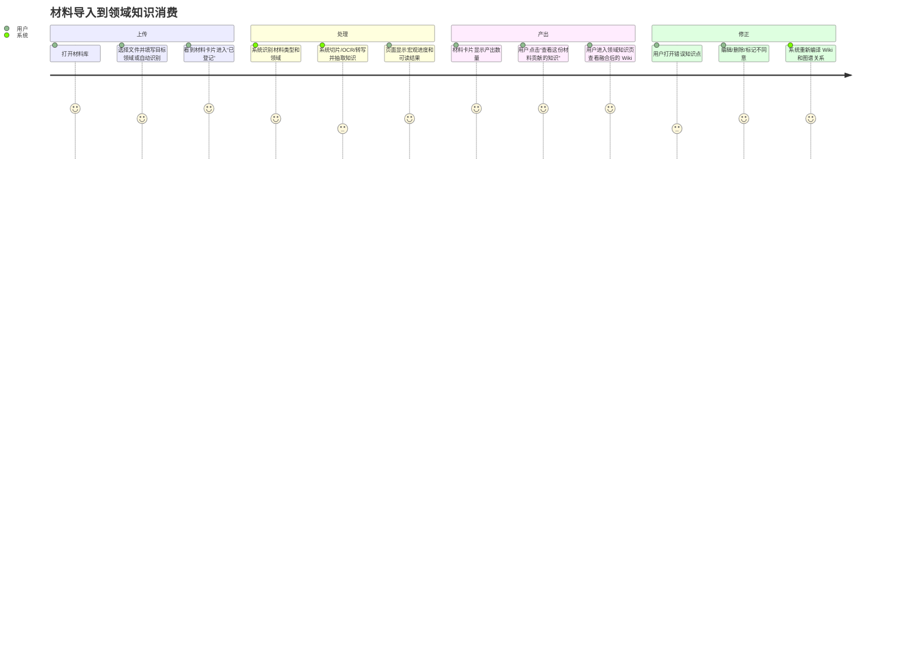

# 从原始材料到领域知识的用户旅程

OpenClaw(ux-01 子Agent)｜2026-05-25

## 1. 结论

KIVO 需要把「材料库」和「领域知识库」设计成同一条旅程的两个视角：

- 材料库回答：我上传的文件现在处理到哪一步、失败在哪里、这份文件产出了哪些知识。
- 领域知识库回答：这些材料沉淀成了哪些可复用的领域知识、它们分布在哪些学科/主题、彼此如何关联。

用户不应该在上传后自己猜「PDF 去哪了」。上传完成后，页面必须给出下一步入口：查看处理进度、查看产出的知识、进入对应领域、修正抽取结果。

证据：当前 spec FR-A02 定义了 Web 上传和导入状态，FR-P01 AC8/AC9 要求领域知识库展示来源材料并可从文件反查知识；现状报告记录用户明确质疑「没看到原始材料入口」「材料库页面跟领域知识库没有融合」。代码里已有 `/wiki/materials` 材料页、`/wiki` 领域知识页、`materials` 表、`subject_nodes` 表和 `entries` 表，但它们在 UI 上还是割裂入口。

## 2. 设计目标

用户上传一份 PDF、图片、笔记、音频或视频后，10 秒内必须知道三件事：

1. 文件已登记，是否正在处理。
2. 系统判断它属于哪个领域/主题。
3. 处理完成后点哪里看它贡献的知识。

处理完成后，用户必须能从两条路回到同一批知识：

- 从材料库进入：按文件查看这份材料的全部产出。
- 从领域知识库进入：按学科/主题查看融合后的知识页、知识点和关系。

证据：陌生人走查记录上传后 30 秒内「列表未变化」「提交后消失」会让用户判断上传失败；FR-P01 AC9 明确要求「点击来源材料可查看该文件提取出的所有知识条目列表」。

## 3. 主旅程图

## 4. 页面路径

### 4.1 发起上传的位置

一级入口叫「材料库」。页面顶部只有一个主操作：上传材料。

上传区需要展示：

- 支持格式：PDF、图片、文本/Markdown、音频、视频。
- 单文件限制。
- 目标领域：默认「自动识别」，用户也可以选择已有领域。
- 是否保留原文件：按配置展示，不让用户猜。

证据：FR-A02 定义 Web 上传入口；FR-W08 定义支持拖拽/选择文件；现有代码 `web/app/(dashboard)/wiki/materials/page.tsx` 已有 `FileUploader`，但页面文案只说「生成 Wiki 页面」，没有说明会进入哪个领域知识结构。

### 4.2 上传中看到什么

上传中不展示内部技术词。用户看到：

- 文件名、大小、类型。
- 状态：上传中。
- 进度条或加载态。
- 上传失败时显示原因：文件太大、格式不支持、网络失败。

不展示：HTTP 状态码、worker、embedding、cron、内部队列名。

证据：用户不写代码、看不懂代码；USER.md 要求汇报和产品文案用人话。

### 4.3 上传成功后下一步

上传成功后，材料卡片必须立刻出现在列表第一位，状态为「已登记，等待处理」。卡片上有四个区域：

1. 基本信息：文件名、类型、上传时间。
2. 系统判断：目标领域、主题节点、材料类型。
3. 处理进度：识别 → 切片/转写 → 抽取知识 → 写入领域 → 生成 Wiki → 建立关系。
4. 下一步按钮：处理完成前是「查看处理详情」，处理完成后是「查看产出的知识」。

证据：陌生人走查中「上传成功但材料列表 API 看不到刚上传文件」被列为 P1；后续修复已有 optimistic card，但设计上还需要补齐“下一步”。

## 5. 处理过程要不要给用户看

处理过程要给用户看，但只给用户看能帮助判断的层级。

### 5.1 展示给用户的步骤

- 已登记：系统已经保存文件。
- 识别材料：判断是 PDF、图片、音频、视频、笔记。
- 提取内容：PDF 切片、图片 OCR、音频转写、视频关键帧/音轨，这些可以合并成「提取内容」。
- 抽取知识：生成概念、方法、题目、易错点、批注。
- 归入领域：自动识别或写入用户选择的学科/主题。
- 生成 Wiki：把原子知识聚合成可读页面。
- 建立关系：和图谱中的前置知识、例题、方法、易混点关联。

### 5.2 不展示给用户的内部细节

- embedding 模型名。
- 向量库参数。
- cron 名称。
- task_queue 状态。
- worker 路径。
- prompt 和 provider。

这些信息只进系统日志或诊断页。

证据：spec 设计硬约束写明「质量门禁、向量化等内部机制不暴露给用户」；当前材料页已有宏观状态 `pending/slicing/extracting/injecting/done/failed` 的映射，说明产品层可读状态已经具备基础。

## 6. 处理完成后点哪里看贡献的知识

处理完成的材料卡片要出现三个按钮：

1. 「查看这份材料贡献的知识」：进入材料详情页，按条目列出这份材料抽取出的知识。
2. 「进入领域知识库」：跳到系统识别出的领域/主题节点。
3. 「打开 Wiki 页面」：跳到聚合后的 Wiki 页面。

材料详情页结构：

- 文件摘要：文件名、处理状态、领域、处理完成时间。
- 产出统计：切片数、知识点数、Wiki 页数、关系数。
- 知识列表：按概念/方法/题目/易错点/批注分组。
- 来源定位：每条知识旁边显示页码、时间戳或图片区域。
- 关系预览：显示这份材料带来的新增图谱关系。

证据：FR-P01 AC8/AC9 要求来源材料区域和正向溯源；当前 DB `materials` 表有 `slice_count`、`extract_count`、`wiki_page_count`、`subject_node_id`，`entries.source_json` 存 materialId，已能支撑文件到知识的反查。

## 7. AI 抽取错了怎么改

用户在材料详情页或 Wiki 详情页都能改。

### 7.1 编辑

入口：知识条目右上角「编辑」。

编辑范围：标题、摘要、正文、类型、所属主题、来源定位备注。

保存后：

- 条目立即更新。
- 相关 Wiki 页面标记为「已根据人工编辑更新」或触发重新编译。
- 图谱关系重新计算或等待下一次后台更新。

证据：现有 `web/components/wiki/space-manager.tsx` 已有知识点编辑弹窗；`web/app/api/wiki/pages/[id]/route.ts` 支持 PATCH。

### 7.2 删除

入口：知识条目右上角「删除」。

删除影响必须说清楚：

- 只删除这条知识，不删除原材料。
- 如果这是某个 Wiki 页面唯一内容，Wiki 页面变成弱 Wiki。
- 删除后关联关系同步移除或隐藏。

证据：现有 Wiki 详情 UI 有删除按钮，API 支持 DELETE；用户报告「删不掉」说明入口或反馈不够清楚。

### 7.3 标记不同意

入口：知识条目旁「不同意」。

这不是删除。它表示用户认为 AI 结论不可信，但可能还要保留原始证据。标记后：

- 条目从默认展示中降权。
- Wiki 页面出现「存在争议」提示。
- 关系边不再作为高可信关联展示。
- 用户可以补一句理由。

证据：FR-P07 允许观点分歧并存，要求用户能看到不同说法；FR-P03 AC5 关系有 confidence，用户确认后可提升到 1.0。当前 spec 没明确定义「不同意」动作，需作为 spec 升级项。

## 8. 用户在材料原文上批注后进哪里

批注先进「Annotation Entry」，再通过关系连接到领域知识。

用户在材料阅读器里划线、圈选、写备注后，系统生成一条批注型知识：

- entry_type = annotation。
- source 指向原材料、页码/时间戳/坐标。
- 关系：annotation annotated_with 原知识点，或 annotation belongs_to 对应主题。
- 展示：材料详情页按原文位置显示，Wiki 页面在「我的批注」区显示。

批注不能只停留在 PDF 标记层。它必须进入领域知识库，否则用户复习知识时看不到自己的判断。

证据：FR-A02 定义 Document AST 的批注/强调层和「批注→内容定位」；FR-P02 AC5 定义 annotation 类型；FR-P03 AC4 定义 `annotated_with` 关系。当前 DB 只有 2 条 annotation，说明数据模型有痕迹，但用户旅程还没完整露出。

## 9. 复习和检索时从哪里进

### 9.1 从材料库进

适合回答：这份 PDF/录音/笔记到底产出了什么。

页面重点：

- 文件处理状态。
- 原文定位。
- 文件内知识清单。
- 文件内批注。
- 失败重试和人工修正。

### 9.2 从领域知识库进

适合回答：我现在要学/查这个领域的知识结构。

页面重点：

- 领域/学科/主题树。
- Wiki 页面。
- 原子知识点。
- 前置关系、例题、方法、易错点。
- 多份材料融合后的统一表述。

### 9.3 从搜索进

适合回答：我知道关键词或问题，但不知道在哪份材料或哪个主题。

搜索结果必须显示来源域：材料、Wiki、知识点、批注。用户点结果后可进入对应视角。

证据：用户质疑来自「材料库像孤岛」「领域知识库像空目录」；FR-P01 同时要求来源材料和目录浏览，说明两种入口都需要存在，但职责不能混。

## 10. 一份材料出现在多个领域怎么办

一份材料可以贡献给多个领域，但原材料只存一份。

设计规则：

- Material 是唯一原文件。
- Material Slice 可以被多个知识点引用。
- Entry 可以挂到多个 subject_node 或多个标签。
- Wiki 页面按主题聚合，可能引用同一份材料的不同片段。
- 材料详情页显示「贡献到这些领域」。
- 领域知识页显示「来源材料」时，同一文件可在多个领域出现，但标注本领域引用了哪些片段。

例子：概率论 PDF 同时含统计推断和数据分析。

- 在「概率论」领域看到：条件概率、全概率公式、贝叶斯公式。
- 在「统计学」领域看到：估计、检验、分布。
- 在「数据分析」领域看到：应用案例和方法。
- 回到材料详情页，看到它贡献了 3 个领域、共 N 条知识。

证据：FR-P01 AC6 写明「一个知识点可以同时属于多个领域目录节点」；当前实现里 `entries.subject_id` 只能单挂一个 subject，若要严格支持多领域，需要补多对多关系表，属于 spec 升级和实现改造。

## 11. 异常和人工介入分支

### 11.1 文件无法解析

用户看到：处理失败，原因是「这份 PDF 没读出文字」或「图片文字识别失败」。

用户可做：

- 重新处理。
- 上传文字版。
- 粘贴 OCR/转写文本继续处理。
- 删除材料。

证据：当前 DB 有 failed/pending/processing 残留，错误包括 OCR 缺失和 PDF worker；backlog P1-3 指出失败可介入只覆盖重试/删除，没有人工修正路径。

### 11.2 领域识别不确定

用户看到：系统不确定该归入哪个领域，请选择。

用户可做：

- 选择已有领域。
- 新建领域。
- 标为通用资料。

证据：FR-P04 AC2 定义低置信度归入默认域，用户可后续手动归类；用户明确提出「自动识别通用 or 学科知识再创建新的树形节点」。

### 11.3 抽取质量低

用户看到：系统只抽出少量知识，建议人工补充或重新处理。

页面不应该生成一篇看起来正常的空 Wiki。

证据：backlog 已记录「切片为 0 / 抽取为 0 时仍生成空 wiki_page」的问题；当前设计必须把弱产出诚实暴露。

### 11.4 关系不可信

用户看到：关联知识按「系统推断」「同材料共现」「用户确认」区分。

用户可做：

- 确认关系。
- 删除关系。
- 标记无关。

证据：FR-P03 AC5 定义 relation confidence；当前 `wiki_links=0 / graph_edges=6256` 说明关系数据存在但可用视图未收敛。

## 12. 需 CEO 拍板

### 12.1 通用知识 vs 学科知识是否作为领域知识库顶层结构

用户多次提到通用/学科分层。当前 spec 没把它定义成顶层结构，DB 只有 `subject_nodes.tree_kind='subject'` 和一个「通用学习资料」节点。

建议拍板：领域知识库顶层固定两类：

- 通用知识：跨学科、方法、学习策略、工具类知识。
- 学科知识：数学、统计、认知科学、生物信息学等具体领域。

### 12.2 「不同意」是否作为正式知识治理动作

当前 spec 有编辑、删除、冲突处理、版本历史，但没有用户对 AI 抽取结果标记不同意的明确动作。

建议拍板：加入「不同意」动作，并要求保留来源证据和理由。

## 13. 最小可用闭环

第一版不需要复杂动画，也不需要炫酷图谱。白底黑字即可。必须先做到：

1. 上传后材料卡片立刻出现。
2. 卡片显示人话进度。
3. 完成后能一键看这份材料产出的知识。
4. 每条知识能回到原文位置。
5. 每条知识能编辑、删除、标记不同意。
6. 领域知识库能从主题树看到这些知识。
7. Wiki 页面能显示来源材料和关联知识。

做到这 7 条，用户才会相信「原始材料 → 领域知识」这条链路真实存在。
